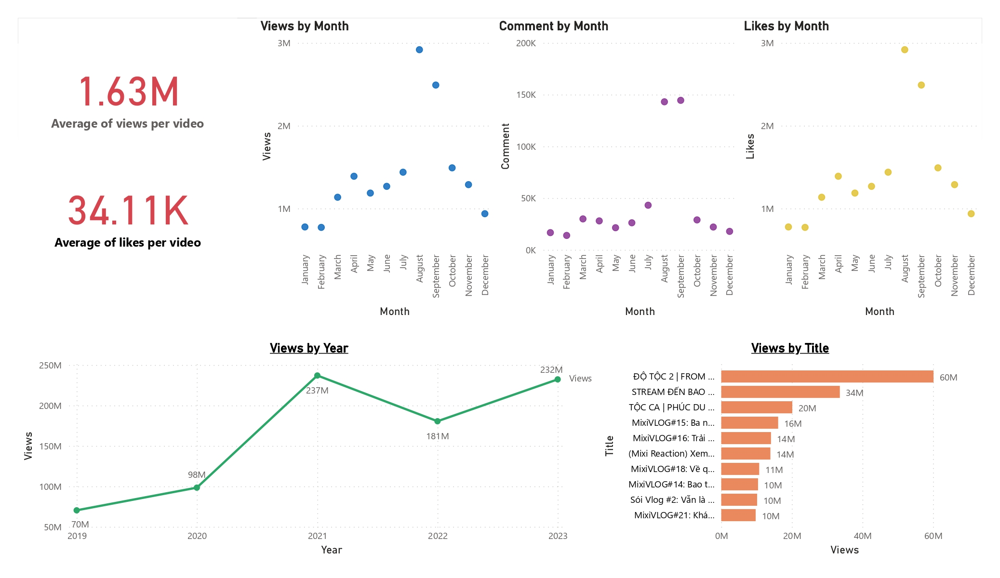

# Crawl data YouTube

### Objective

This project's primary objectives include extracting data from videos on the MixiGaming channel, transforming the data, and saving it to AWS S3. The project leverages Airflow to execute these tasks, utilizing Python for data transformation.

### Architecture

### Process

1. Using YouTube Data API v3 to retrieve video_ids from the mixigaming channel.
2. With the video_ids, use the Python requests library to fetch data from videos on the mixigaming channel.
3. Using Python to transform the data.
4. Using Pandas to upload the data to AWS S3.
5. Using Power BI to retrieve data from AWS S3 through a Python script and subsequently leveraging the obtained data for report visualization.

### Visualization

### Setup

##### Python setup

- [Install Library](requirements.txt)

##### Airflow setup

- [Install Airflow](docker-compose.yaml)

##### Docker setup

- [Install Docker](https://docs.docker.com/desktop/install/windows-install)

#### Power BI setup

- [Setup Power BI connect to AWS S3](script_powerbi_s3.py)
